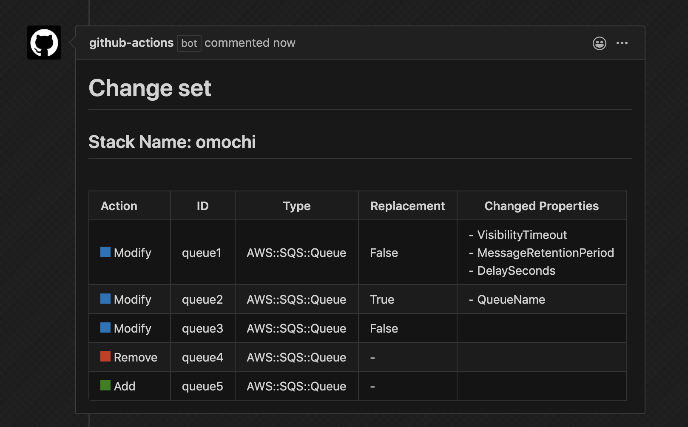
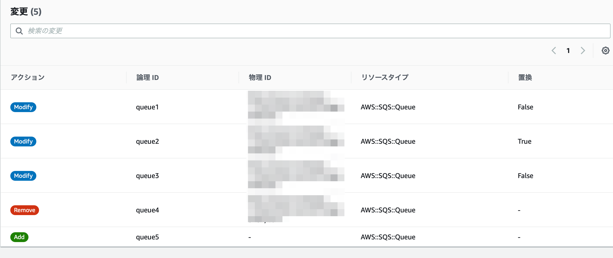

# Describe AWS CloudFormation change set Action for GitHub Actions
Describe cfn stack diff using `describe-change-set` API.<br>
cf. https://docs.aws.amazon.com/cli/latest/reference/cloudformation/describe-change-set.html

This action exports json output as an Github Action output variable that actions running later in a job can use.<br>
Additionally, exports table formatted diff file. Below shows how to use it to post pull request comment.<br>

ex. describe change set diff like management console.





`Changed Properties` is not shown on management console, but exists in `describe-change-set` API response.

## Table of Contents

- [Usage](#usage)
- [Environment variables](#environment-variables)
- [Credentials and Region](#credentials-and-region)
- [Permissions](#permissions)
- [License Summary](#license-summary)
- [Contributing](#contributing)

# Usage

```yaml
  - name: checkout
    uses: actions/checkout@v2
  
  - name: configure AWS credentials
    uses: aws-actions/configure-aws-credentials@v1
    with:
      aws-access-key-id: ${{ secrets.AWS_ACCESS_KEY_ID }}
      aws-secret-access-key: ${{ secrets.AWS_SECRET_ACCESS_KEY }}
      aws-region: ap-northeast-1

  - name: describe change set
    id: describe-change-set
    uses: Blue-Pix/describe-cfn-change-set@v2.1
    with:
      stack_name: omochi
      template_body: after.cf.yml

  - name: archive diff
    uses: actions/upload-artifact@v1
    with:
      name: diff
      path: ${{ steps.describe-change-set.outputs.diff_file_path }}

  - name: Download diff markdown
    uses: actions/download-artifact@v1
    with:
      name: diff

  - name: Post comments
    env:
      GITHUB_TOKEN: ${{ secrets.GITHUB_TOKEN }}
      URL: ${{ github.event.pull_request.comments_url }}
      FILE_PATH: ${{ steps.describe-change-set.outputs.diff_file_path }}
    run: |
      cat ${FILE_PATH} | xargs echo
      curl -X POST \
           -H "Authorization: token ${GITHUB_TOKEN}" \
           -d "{\"body\": \"$(cat ${FILE_PATH} | xargs echo)\"}" \
           ${URL}
```

for example, you set trigger on `pull_request`, this action posts a comment which describes change set like management console.<br>

See [action.yml](https://github.com/Blue-Pix/describe-cfn-change-set/blob/master/action.yml) for the full documentation for this action's inputs and outputs.

# Environment variables
- `stack_name`:  CloudFormation stack name to apply change. (**required**)
- `template_body`:  CloudFormation template file path. (**required**)

# Credentials and Region
Use the [`aws-actions/configure-aws-credentials` action](https://github.com/aws-actions/configure-aws-credentials) to configure the GitHub Actions environment with environment variables containing AWS credentials and your desired region.

# Permissions
This action requires the following minimum set of permissions:

```json
{
    "Version": "2012-10-17",
    "Statement": [
        {
            "Sid": "VisualEditor0",
            "Effect": "Allow",
            "Action": [
                "cloudformation:CreateChangeSet",
                "cloudformation:DescribeChangeSet",
                "cloudformation:DeleteChangeSet"
            ],
            "Resource": "*"
        }
    ]
}
```

The Action calls `create-change-set` api with random uuid as change set name first, then `describe-change-set`.<br>
After writing output to file, remove temporary change set by `delete-change-set`.<br>
**Note.** do not restrict change-set-name in `Resource` condition because change-set-name is random.<br>
ex. ac7c731cd-b210-4e1a-a355-804847ee9156

# License Summary
This code is made available under the MIT license.

# Contributing
Any contributing is welcome 🎉
